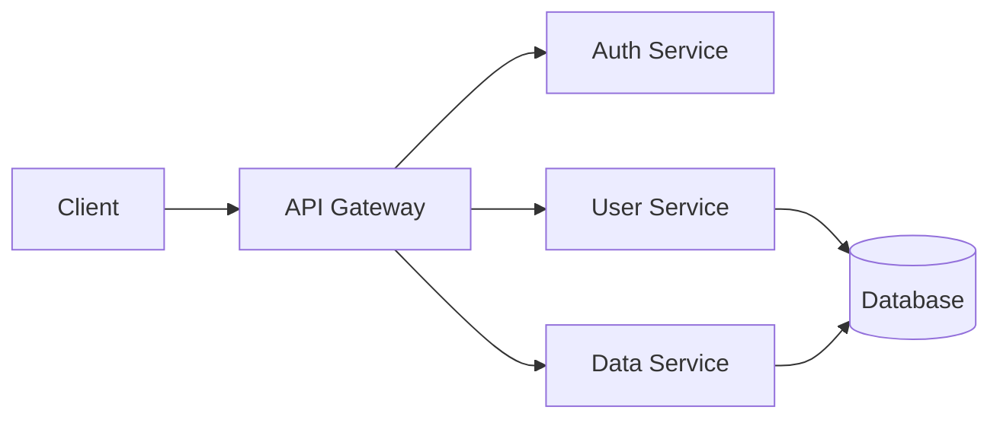
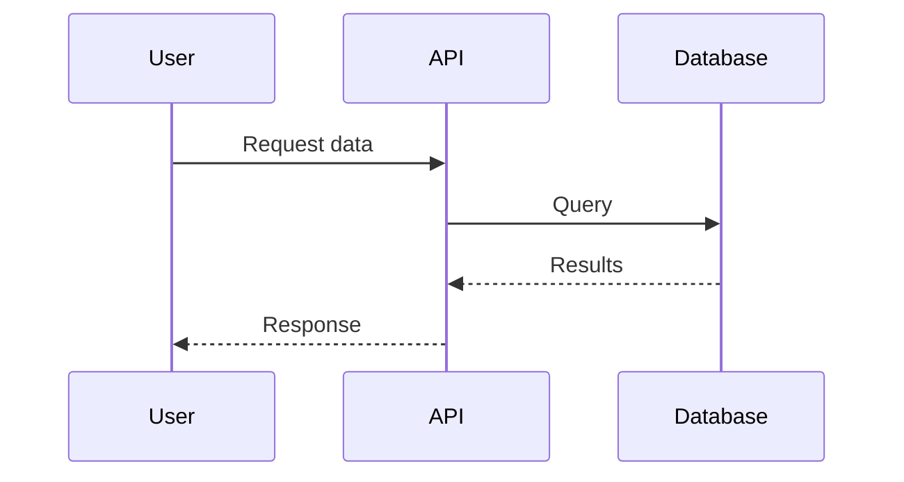

This post demonstrates the technical features available for writing.

## Code

Syntax highlighting works for many languages:

```python
def fibonacci(n: int) -> int:
    """Calculate the nth Fibonacci number."""
    if n <= 1:
        return n
    return fibonacci(n - 1) + fibonacci(n - 2)

# With memoization
from functools import lru_cache

@lru_cache(maxsize=None)
def fib_fast(n: int) -> int:
    if n <= 1:
        return n
    return fib_fast(n - 1) + fib_fast(n - 2)
```

And here's some JavaScript:

```javascript
const debounce = (fn, delay) => {
  let timeoutId;
  return (...args) => {
    clearTimeout(timeoutId);
    timeoutId = setTimeout(() => fn(...args), delay);
  };
};
```

## Mathematics

Inline math like $E = mc^2$ works seamlessly in text.

For display equations, use double dollar signs:

$$
\nabla \times \mathbf{E} = -\frac{\partial \mathbf{B}}{\partial t}
$$

The quadratic formula:

$$
x = \frac{-b \pm \sqrt{b^2 - 4ac}}{2a}
$$

## Diagrams

System architecture and flowcharts using Mermaid:



A sequence diagram:



---

These features make it easy to write technical content without leaving markdown.
